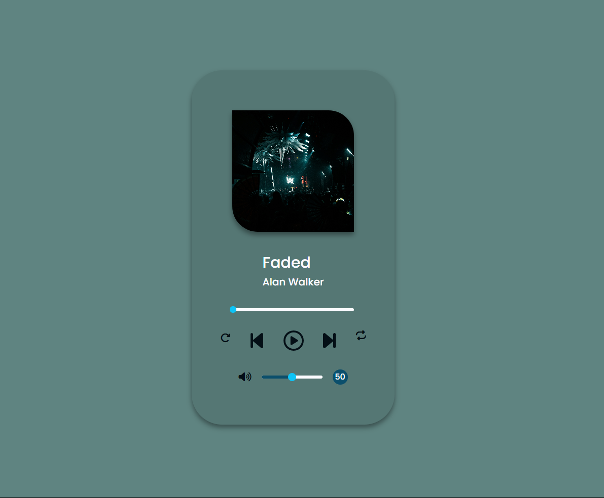

# Music Player

Showcasing my skills in HTML, CSS, and JavaScript, I built a versatile music player. It boasts a user-friendly interface with intuitive playback controls (play/pause, volume, seek bar) and a responsive design that adapts seamlessly across devices.

Leveraging HTML5, I efficiently integrated audio elements and structured a clean layout. With CSS, I crafted a visually appealing design that adjusts for various screen sizes. JavaScript shines through the interactive playback controls, offering a smooth music listening experience. (Playlist functionality coming soon!)

## Acknowledgements

 - [font awesome](https://fontawesome.com/)
 - [google fonts](https://fonts.google.com/)
 - [Unsplash](https://unsplash.com/)

## Appendix

This music player provides a comprehensive audio playback experience, built with HTML, CSS, and JavaScript. Users can seamlessly control their music with intuitive controls like play/pause, next/previous track, a seek bar for precise navigation, and volume adjustment with mute functionality. Additionally, the player boasts a responsive user interface, ensuring smooth operation across various devices, from desktops to mobile phones.

Focus on User Experience:

This description emphasizes user experience by highlighting functionalities that directly impact how users interact with the music player.

Technical Details:

While not explicitly mentioned, the use of HTML, CSS, and JavaScript is implied by stating the player is "built" with them.

Future Development:

The description concludes by mentioning the planned addition of a playlist feature, demonstrating your commitment to further improvement.

## Authors

- [@Ravi Panchal](https://github.com/saneinfringer)

## Color Reference

| Color             | Hex                                                                |
| ----------------- | ------------------------------------------------------------------ |
| Example Color |  #0dc4f7 |
| Example Color |  #0B4F6C |
| Example Color |  #040f16 |
| Example Color |  #FBFBFF |

## Demo

[link to demo](https://saneinfringer.github.io/musicPlayer/)

## Features

- Play/Pause
- Repeat
- Replay
- SeekBar
- Mute/Unmute
- VolumeBar
- image change
- background change

## Lessons Learned

knowledge of images in arrays to create dynamic visualizations that react to the music.
Update the progress bar dynamically using audio events.
Including features like repeat modes.
Responsive Design: Ensure the music player adapts seamlessly across different screen sizes (desktop, mobile, tablets). Optimize your CSS layout for responsiveness.
Focus on User Experience: Prioritize a clean, intuitive interface with clear visual cues and easy-to-understand controls.
Code Optimization: Write clean, well-commented code for better maintainability and potential collaboration.
Testing and Refinement: Test your music player thoroughly on different devices and browsers to identify and fix any bugs or usability issues.

## Optimizations

User Experience:

Intuitive Interface: Design a clean and user-friendly interface with easy-to-understand controls. Consider user testing to identify and address any usability issues.

## Screenshots

## License

[MIT](https://choosealicense.com/licenses/mit/)

## Feedback

If you have any feedback, please reach out to us at xiansfactor@gmail.com

## Support

For support, email xiansfactor@.com or join on instagram @v8_m5_cs.

